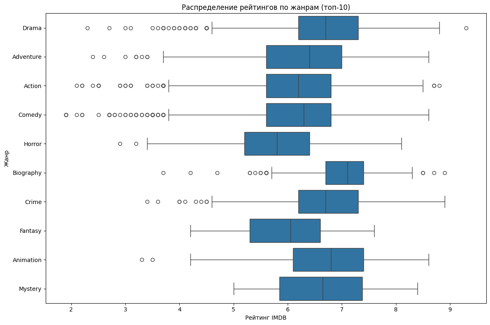
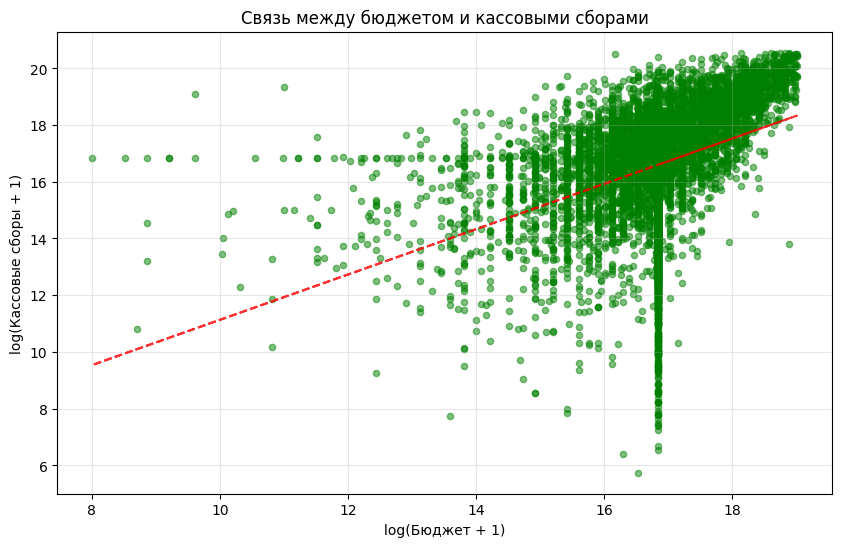

```python
import pandas as pd
import numpy as np
import matplotlib.pyplot as plt
import seaborn as sns
from sklearn.model_selection import train_test_split, cross_val_score, GridSearchCV
from sklearn.preprocessing import StandardScaler, LabelEncoder, PolynomialFeatures
from sklearn.linear_model import LinearRegression, Ridge, Lasso, LogisticRegression
from sklearn.neighbors import KNeighborsClassifier
from sklearn.tree import DecisionTreeClassifier
from sklearn.metrics import mean_squared_error, mean_absolute_error, r2_score
from sklearn.metrics import accuracy_score, precision_score, recall_score, f1_score, confusion_matrix
import warnings
warnings.filterwarnings('ignore')
```


```python
print("=== БЛОК 1: ЗАГРУЗКА И ИЗУЧЕНИЕ ДАННЫХ ===")
```

    === БЛОК 1: ЗАГРУЗКА И ИЗУЧЕНИЕ ДАННЫХ ===


```python
# Загрузка данных
df = pd.read_csv('movies.csv')

print("Первые 5 строк датасета:")
df.head()
```

    Первые 5 строк датасета:


<div>
<style scoped>
    .dataframe tbody tr th:only-of-type {
        vertical-align: middle;
    }

    .dataframe tbody tr th {
        vertical-align: top;
    }

    .dataframe thead th {
        text-align: right;
    }
</style>
<table border="1" class="dataframe">
  <thead>
    <tr style="text-align: right;">
      <th></th>
      <th>name</th>
      <th>rating</th>
      <th>genre</th>
      <th>year</th>
      <th>released</th>
      <th>score</th>
      <th>votes</th>
      <th>director</th>
      <th>writer</th>
      <th>star</th>
      <th>country</th>
      <th>budget</th>
      <th>gross</th>
      <th>company</th>
      <th>runtime</th>
    </tr>
  </thead>
  <tbody>
    <tr>
      <th>0</th>
      <td>The Shining</td>
      <td>R</td>
      <td>Drama</td>
      <td>1980</td>
      <td>June 13, 1980 (United States)</td>
      <td>8.4</td>
      <td>927000.0</td>
      <td>Stanley Kubrick</td>
      <td>Stephen King</td>
      <td>Jack Nicholson</td>
      <td>United Kingdom</td>
      <td>19000000.0</td>
      <td>46998772.0</td>
      <td>Warner Bros.</td>
      <td>146.0</td>
    </tr>
    <tr>
      <th>1</th>
      <td>The Blue Lagoon</td>
      <td>R</td>
      <td>Adventure</td>
      <td>1980</td>
      <td>July 2, 1980 (United States)</td>
      <td>5.8</td>
      <td>65000.0</td>
      <td>Randal Kleiser</td>
      <td>Henry De Vere Stacpoole</td>
      <td>Brooke Shields</td>
      <td>United States</td>
      <td>4500000.0</td>
      <td>58853106.0</td>
      <td>Columbia Pictures</td>
      <td>104.0</td>
    </tr>
    <tr>
      <th>2</th>
      <td>Star Wars: Episode V - The Empire Strikes Back</td>
      <td>PG</td>
      <td>Action</td>
      <td>1980</td>
      <td>June 20, 1980 (United States)</td>
      <td>8.7</td>
      <td>1200000.0</td>
      <td>Irvin Kershner</td>
      <td>Leigh Brackett</td>
      <td>Mark Hamill</td>
      <td>United States</td>
      <td>18000000.0</td>
      <td>538375067.0</td>
      <td>Lucasfilm</td>
      <td>124.0</td>
    </tr>
    <tr>
      <th>3</th>
      <td>Airplane!</td>
      <td>PG</td>
      <td>Comedy</td>
      <td>1980</td>
      <td>July 2, 1980 (United States)</td>
      <td>7.7</td>
      <td>221000.0</td>
      <td>Jim Abrahams</td>
      <td>Jim Abrahams</td>
      <td>Robert Hays</td>
      <td>United States</td>
      <td>3500000.0</td>
      <td>83453539.0</td>
      <td>Paramount Pictures</td>
      <td>88.0</td>
    </tr>
    <tr>
      <th>4</th>
      <td>Caddyshack</td>
      <td>R</td>
      <td>Comedy</td>
      <td>1980</td>
      <td>July 25, 1980 (United States)</td>
      <td>7.3</td>
      <td>108000.0</td>
      <td>Harold Ramis</td>
      <td>Brian Doyle-Murray</td>
      <td>Chevy Chase</td>
      <td>United States</td>
      <td>6000000.0</td>
      <td>39846344.0</td>
      <td>Orion Pictures</td>
      <td>98.0</td>
    </tr>
  </tbody>
</table>
</div>


```python
print("\nБазовая информация о датасете:")
df.info()
```

    
    Базовая информация о датасете:
    <class 'pandas.core.frame.DataFrame'>
    RangeIndex: 7668 entries, 0 to 7667
    Data columns (total 15 columns):
     #   Column    Non-Null Count  Dtype  
    ---  ------    --------------  -----  
     0   name      7668 non-null   object 
     1   rating    7591 non-null   object 
     2   genre     7668 non-null   object 
     3   year      7668 non-null   int64  
     4   released  7666 non-null   object 
     5   score     7665 non-null   float64
     6   votes     7665 non-null   float64
     7   director  7668 non-null   object 
     8   writer    7665 non-null   object 
     9   star      7667 non-null   object 
     10  country   7665 non-null   object 
     11  budget    5497 non-null   float64
     12  gross     7479 non-null   float64
     13  company   7651 non-null   object 
     14  runtime   7664 non-null   float64
    dtypes: float64(5), int64(1), object(9)
    memory usage: 898.7+ KB


```python
print(f"\nРазмер датасета: {df.shape}")
print(f"Количество строк: {df.shape[0]}")
print(f"Количество столбцов: {df.shape[1]}")
```

    
    Размер датасета: (7668, 15)
    Количество строк: 7668
    Количество столбцов: 15


```python
print("\nСтатистическое описание числовых колонок:")
df.describe()
```

    
    Статистическое описание числовых колонок:


<div>
<style scoped>
    .dataframe tbody tr th:only-of-type {
        vertical-align: middle;
    }

    .dataframe tbody tr th {
        vertical-align: top;
    }

    .dataframe thead th {
        text-align: right;
    }
</style>
<table border="1" class="dataframe">
  <thead>
    <tr style="text-align: right;">
      <th></th>
      <th>year</th>
      <th>score</th>
      <th>votes</th>
      <th>budget</th>
      <th>gross</th>
      <th>runtime</th>
    </tr>
  </thead>
  <tbody>
    <tr>
      <th>count</th>
      <td>7668.000000</td>
      <td>7665.000000</td>
      <td>7.665000e+03</td>
      <td>5.497000e+03</td>
      <td>7.479000e+03</td>
      <td>7664.000000</td>
    </tr>
    <tr>
      <th>mean</th>
      <td>2000.405451</td>
      <td>6.390411</td>
      <td>8.810850e+04</td>
      <td>3.558988e+07</td>
      <td>7.850054e+07</td>
      <td>107.261613</td>
    </tr>
    <tr>
      <th>std</th>
      <td>11.153508</td>
      <td>0.968842</td>
      <td>1.633238e+05</td>
      <td>4.145730e+07</td>
      <td>1.657251e+08</td>
      <td>18.581247</td>
    </tr>
    <tr>
      <th>min</th>
      <td>1980.000000</td>
      <td>1.900000</td>
      <td>7.000000e+00</td>
      <td>3.000000e+03</td>
      <td>3.090000e+02</td>
      <td>55.000000</td>
    </tr>
    <tr>
      <th>25%</th>
      <td>1991.000000</td>
      <td>5.800000</td>
      <td>9.100000e+03</td>
      <td>1.000000e+07</td>
      <td>4.532056e+06</td>
      <td>95.000000</td>
    </tr>
    <tr>
      <th>50%</th>
      <td>2000.000000</td>
      <td>6.500000</td>
      <td>3.300000e+04</td>
      <td>2.050000e+07</td>
      <td>2.020576e+07</td>
      <td>104.000000</td>
    </tr>
    <tr>
      <th>75%</th>
      <td>2010.000000</td>
      <td>7.100000</td>
      <td>9.300000e+04</td>
      <td>4.500000e+07</td>
      <td>7.601669e+07</td>
      <td>116.000000</td>
    </tr>
    <tr>
      <th>max</th>
      <td>2020.000000</td>
      <td>9.300000</td>
      <td>2.400000e+06</td>
      <td>3.560000e+08</td>
      <td>2.847246e+09</td>
      <td>366.000000</td>
    </tr>
  </tbody>
</table>
</div>


```python
print("\nТипы данных в датасете:")
df.dtypes
```

    
    Типы данных в датасете:


    name         object
    rating       object
    genre        object
    year          int64
    released     object
    score       float64
    votes       float64
    director     object
    writer       object
    star         object
    country      object
    budget      float64
    gross       float64
    company      object
    runtime     float64
    dtype: object


```python
print("=== БЛОК 2: ПРЕДОБРАБОТКА ДАННЫХ ===")
```

    === БЛОК 2: ПРЕДОБРАБОТКА ДАННЫХ ===


```python
# Анализ пропущенных значений
print("Пропущенные значения по столбцам:")
missing_data = df.isnull().sum()
missing_data = missing_data[missing_data > 0]
print(missing_data)

if len(missing_data) > 0:
    plt.figure(figsize=(10, 6))
    missing_data.plot(kind='bar', color='coral')
    plt.title('Пропущенные значения по столбцам')
    plt.xlabel('Столбцы')
    plt.ylabel('Количество пропусков')
    plt.xticks(rotation=45)
    plt.show()
else:
    print("Пропущенных значений нет")
```

    Пропущенные значения по столбцам:
    rating        77
    released       2
    score          3
    votes          3
    writer         3
    star           1
    country        3
    budget      2171
    gross        189
    company       17
    runtime        4
    dtype: int64


    

    


```python
# Создаем чистую копию датасета
df_clean = df.copy()

print("Обработка пропущенных значений:")

# Заполнение числовых столбцов медианой
numeric_columns = ['budget', 'gross', 'runtime', 'score', 'votes']
for col in numeric_columns:
    if col in df_clean.columns and df_clean[col].isnull().sum() > 0:
        median_val = df_clean[col].median()
        df_clean[col].fillna(median_val, inplace=True)
        print(f"Заполнено пропусков в {col}: {df_clean[col].isnull().sum()} -> 0")

# Заполнение категориальных столбцов модой
categorical_columns = ['genre', 'country', 'rating', 'director']
for col in categorical_columns:
    if col in df_clean.columns and df_clean[col].isnull().sum() > 0:
        mode_val = df_clean[col].mode()[0] if not df_clean[col].mode().empty else 'Unknown'
        df_clean[col].fillna(mode_val, inplace=True)
        print(f"Заполнено пропусков в {col}: {df_clean[col].isnull().sum()} -> 0")

print(f"\nОбщее количество пропусков после обработки: {df_clean.isnull().sum().sum()}")
```

    Обработка пропущенных значений:
    Заполнено пропусков в budget: 0 -> 0
    Заполнено пропусков в gross: 0 -> 0
    Заполнено пропусков в runtime: 0 -> 0
    Заполнено пропусков в score: 0 -> 0
    Заполнено пропусков в votes: 0 -> 0
    Заполнено пропусков в country: 0 -> 0
    Заполнено пропусков в rating: 0 -> 0
    
    Общее количество пропусков после обработки: 23


```python
# Поиск и удаление дубликатов
duplicates_count = df_clean.duplicated().sum()
print(f"\nКоличество полных дубликатов: {duplicates_count}")

if duplicates_count > 0:
    df_clean = df_clean.drop_duplicates()
    print(f"Дубликаты удалены. Новый размер датасета: {df_clean.shape}")
else:
    print("Дубликатов не найдено")
```

    
    Количество полных дубликатов: 0
    Дубликатов не найдено


```python
# Анализ выбросов
print("\nАнализ выбросов в числовых столбцах:")

numeric_cols = ['budget', 'gross', 'score', 'runtime']
for col in numeric_cols:
    if col in df_clean.columns:
        Q1 = df_clean[col].quantile(0.25)
        Q3 = df_clean[col].quantile(0.75)
        IQR = Q3 - Q1
        lower_bound = Q1 - 1.5 * IQR
        upper_bound = Q3 + 1.5 * IQR
        outliers = df_clean[(df_clean[col] < lower_bound) | (df_clean[col] > upper_bound)].shape[0]
        print(f"{col}: {outliers} выбросов")

# Удаление явных выбросов
initial_size = df_clean.shape[0]
df_clean = df_clean[(df_clean['budget'] > 0) & (df_clean['gross'] > 0)]
df_clean = df_clean[(df_clean['budget'] < df_clean['budget'].quantile(0.99)) & 
                   (df_clean['gross'] < df_clean['gross'].quantile(0.99))]

print(f"\nУдалено записей из-за выбросов: {initial_size - df_clean.shape[0]}")
print(f"Итоговый размер чистого датасета: {df_clean.shape}")
```

    
    Анализ выбросов в числовых столбцах:
    budget: 1008 выбросов
    gross: 911 выбросов
    score: 119 выбросов
    runtime: 240 выбросов
    
    Удалено записей из-за выбросов: 124
    Итоговый размер чистого датасета: (7544, 15)


```python
# Сохранение чистого датасета
df_clean.to_csv('movies_clean.csv', index=False)
print("Чистый датасет сохранен как 'movies_clean.csv'")
```

    Чистый датасет сохранен как 'movies_clean.csv'


```python
print("=== БЛОК 3: ВИЗУАЛИЗАЦИЯ И АНАЛИЗ ===")
```

    === БЛОК 3: ВИЗУАЛИЗАЦИЯ И АНАЛИЗ ===


```python
# 1. Гистограмма распределения рейтингов IMDB
plt.figure(figsize=(10, 6))
plt.hist(df_clean['score'], bins=30, alpha=0.7, color='skyblue', edgecolor='black')
plt.title('Распределение рейтингов IMDB')
plt.xlabel('Рейтинг')
plt.ylabel('Количество фильмов')
plt.grid(True, alpha=0.3)
plt.show()
```


    

    


```python
# 2. Гистограмма кассовых сборов (логарифмическая шкала)
plt.figure(figsize=(12, 6))
plt.hist(np.log1p(df_clean['gross']), bins=30, alpha=0.7, color='lightcoral', edgecolor='black')
plt.title('Распределение кассовых сборов (логарифмическая шкала)', fontsize=14)
plt.xlabel('log(Кассовые сборы + 1)', fontsize=12)
plt.ylabel('Количество фильмов', fontsize=12)
plt.grid(True, alpha=0.3)
plt.show()
```


    

    


```python
# 3. Корреляционная матрица
plt.figure(figsize=(10, 8))
numeric_df = df_clean.select_dtypes(include=[np.number])
correlation_matrix = numeric_df.corr()
sns.heatmap(correlation_matrix, annot=True, cmap='coolwarm', center=0, fmt='.2f')
plt.title('Корреляционная матрица числовых переменных', fontsize=14)
plt.tight_layout()
plt.show()
```


    

    


```python
# 4. Boxplot для анализа рейтингов по жанрам
plt.figure(figsize=(12, 8))
top_genres = df_clean['genre'].value_counts().head(10).index
genre_data = df_clean[df_clean['genre'].isin(top_genres)]
sns.boxplot(data=genre_data, x='score', y='genre')
plt.title('Распределение рейтингов по жанрам (топ-10)')
plt.xlabel('Рейтинг IMDB')
plt.ylabel('Жанр')
plt.tight_layout()
plt.show()
```


    

    


```python
# 5. Связь между бюджетом и кассовыми сборами
plt.figure(figsize=(10, 6))
plt.scatter(np.log1p(df_clean['budget']), np.log1p(df_clean['gross']), 
            alpha=0.5, color='green', s=20)
plt.title('Связь между бюджетом и кассовыми сборами')
plt.xlabel('log(Бюджет + 1)')
plt.ylabel('log(Кассовые сборы + 1)')
plt.grid(True, alpha=0.3)

# Добавляем линию тренда
z = np.polyfit(np.log1p(df_clean['budget']), np.log1p(df_clean['gross']), 1)
p = np.poly1d(z)
plt.plot(np.log1p(df_clean['budget']), p(np.log1p(df_clean['budget'])), "r--", alpha=0.8)

plt.show()
```


    

    


```python
# 6. Анализ трендов по годам
fig, (ax1, ax2) = plt.subplots(1, 2, figsize=(15, 5))

# Тренд рейтингов по годам
yearly_rating = df_clean.groupby('year')['score'].mean()
ax1.plot(yearly_rating.index, yearly_rating.values, marker='o', linewidth=2)
ax1.set_title('Средний рейтинг IMDB по годам')
ax1.set_xlabel('Год')
ax1.set_ylabel('Средний рейтинг')
ax1.grid(True, alpha=0.3)

# Тренд бюджетов по годам
yearly_budget = df_clean.groupby('year')['budget'].mean()
ax2.plot(yearly_budget.index, yearly_budget.values / 1e6, marker='s', linewidth=2, color='red')
ax2.set_title('Средний бюджет по годам (в млн)')
ax2.set_xlabel('Год')
ax2.set_ylabel('Средний бюджет (млн)')
ax2.grid(True, alpha=0.3)

plt.tight_layout()
plt.show()
```


    

    


```python
print("=== БЛОК 4: ВЫВОДА И ИНТЕРПРИТАЦИИ ===\n")
```

    === БЛОК 4: ВЫВОДА И ИНТЕРПРИТАЦИИ ===
    


```python
top_genres = df_clean['genre'].value_counts().head(5)
print("Топ-5 самых популярных жанров:")
for genre, count in top_genres.items():
    print(f"   - {genre}: {count} фильмов")
```

    Топ-5 самых популярных жанров:
       - Comedy: 2245 фильмов
       - Action: 1624 фильмов
       - Drama: 1517 фильмов
       - Crime: 550 фильмов
       - Biography: 442 фильмов


```python
print("=== БЛОК 5: ПОДГОТОВКА ДАННЫХ ДЛЯ МАШИННОГО ОБУЧЕНИЯ ===\n")
```

    === БЛОК 5: ПОДГОТОВКА ДАННЫХ ДЛЯ МАШИННОГО ОБУЧЕНИЯ ===
    


```python
# Определение целевой переменной и признаков
print("Определение целевой переменной: рейтинг IMDB")
X = df_clean[['budget', 'gross', 'runtime', 'year', 'votes']]
y = df_clean['score']

print(f"Признаки: {X.shape}")
print(f"Целевая переменная: {y.shape}")
```

    Определение целевой переменной: рейтинг IMDB
    Признаки: (7544, 5)
    Целевая переменная: (7544,)


```python
# Добавление категориальных признаков через one-hot encoding
print("Добавление категориальных признаков...")
categorical_features = ['genre', 'country']

for feature in categorical_features:
    if feature in df_clean.columns:
        dummies = pd.get_dummies(df_clean[feature], prefix=feature, drop_first=True).astype(int)
        X = pd.concat([X, dummies], axis=1)

print(f"Размерность признаков после кодирования: {X.shape}")
```

    Добавление категориальных признаков...
    Размерность признаков после кодирования: (7544, 81)


```python
# Разделение на обучающую и тестовую выборки
X_train, X_test, y_train, y_test = train_test_split(X, y, test_size=0.2, random_state=42)

print(f"Обучающая выборка: {X_train.shape}")
print(f"Тестовая выборка: {X_test.shape}")
```

    Обучающая выборка: (6035, 81)
    Тестовая выборка: (1509, 81)


```python
# Масштабирование признаков
scaler = StandardScaler()
X_train_scaled = scaler.fit_transform(X_train)
X_test_scaled = scaler.transform(X_test)

print("Масштабирование признаков завершено")
```

    Масштабирование признаков завершено


```python
# Анализ распределения целевой переменной
print("Распределение целевой переменной (рейтинг IMDB):")
print(f"Среднее: {y.mean():.2f}")
print(f"Стандартное отклонение: {y.std():.2f}")
print(f"Минимальное значение: {y.min():.2f}")
print(f"Максимальное значение: {y.max():.2f}")

plt.figure(figsize=(10, 4))
plt.hist(y, bins=30, alpha=0.7, color='lightblue', edgecolor='black')
plt.title('Распределение целевой переменной - рейтинг IMDB')
plt.xlabel('Рейтинг')
plt.ylabel('Количество')
plt.grid(True, alpha=0.3)
plt.show()
```

    Распределение целевой переменной (рейтинг IMDB):
    Среднее: 6.38
    Стандартное отклонение: 0.97
    Минимальное значение: 1.90
    Максимальное значение: 9.30


    

    


```python
print("=== БЛОК 6: ЗАДАЧА РЕГРЕССИИ ===\n")
```

    === БЛОК 6: ЗАДАЧА РЕГРЕССИИ ===
    


```python
# 1. Линейная регрессия
print("1. Линейная регрессия:")
lr_model = LinearRegression()
lr_model.fit(X_train_scaled, y_train)
y_pred_lr = lr_model.predict(X_test_scaled)

mse_lr = mean_squared_error(y_test, y_pred_lr)
mae_lr = mean_absolute_error(y_test, y_pred_lr)
r2_lr = r2_score(y_test, y_pred_lr)

print(f"   MSE: {mse_lr:.4f}")
print(f"   MAE: {mae_lr:.4f}")
print(f"   R²: {r2_lr:.4f}")
```

    1. Линейная регрессия:
       MSE: 0.5844
       MAE: 0.5833
       R²: 0.3848


```python
# 2. Полиномиальная регрессия
print("\n2. Полиномиальная регрессия (степень 2):")
poly = PolynomialFeatures(degree=2, include_bias=False)
X_train_poly = poly.fit_transform(X_train_scaled[:, :5])  # Только первые 5 признаков
X_test_poly = poly.transform(X_test_scaled[:, :5])

poly_model = LinearRegression()
poly_model.fit(X_train_poly, y_train)
y_pred_poly = poly_model.predict(X_test_poly)

mse_poly = mean_squared_error(y_test, y_pred_poly)
mae_poly = mean_absolute_error(y_test, y_pred_poly)
r2_poly = r2_score(y_test, y_pred_poly)

print(f"   MSE: {mse_poly:.4f}")
print(f"   MAE: {mae_poly:.4f}")
print(f"   R²: {r2_poly:.4f}")
```

    
    2. Полиномиальная регрессия (степень 2):
       MSE: 0.6301
       MAE: 0.5989
       R²: 0.3368


```python
# 3. Ridge регрессия
print("\n3. Ridge регрессия:")
ridge_model = Ridge(alpha=1.0)
ridge_model.fit(X_train_scaled, y_train)
y_pred_ridge = ridge_model.predict(X_test_scaled)

mse_ridge = mean_squared_error(y_test, y_pred_ridge)
mae_ridge = mean_absolute_error(y_test, y_pred_ridge)
r2_ridge = r2_score(y_test, y_pred_ridge)

print(f"   MSE: {mse_ridge:.4f}")
print(f"   MAE: {mae_ridge:.4f}")
print(f"   R²: {r2_ridge:.4f}")
```

    
    3. Ridge регрессия:
       MSE: 0.5844
       MAE: 0.5834
       R²: 0.3848


```python
# Сравнение моделей регрессии
regression_comparison = pd.DataFrame({
    'Модель': ['Линейная регрессия', 'Полиномиальная регрессия', 'Ridge регрессия'],
    'MSE': [mse_lr, mse_poly, mse_ridge],
    'MAE': [mae_lr, mae_poly, mae_ridge],
    'R²': [r2_lr, r2_poly, r2_ridge]
})

print("\nСравнение моделей регрессии:")
print(regression_comparison.round(4))
```

    
    Сравнение моделей регрессии:
                         Модель     MSE     MAE      R²
    0        Линейная регрессия  0.5844  0.5833  0.3848
    1  Полиномиальная регрессия  0.6301  0.5989  0.3368
    2           Ridge регрессия  0.5844  0.5834  0.3848


```python
# Анализ важности признаков для линейной регрессии
feature_importance = pd.DataFrame({
    'Признак': X.columns,
    'Важность': abs(lr_model.coef_)
}).sort_values('Важность', ascending=False)

print("\nТоп-10 самых важных признаков для предсказания рейтинга:")
print(feature_importance.head(10))
```

    
    Топ-10 самых важных признаков для предсказания рейтинга:
                       Признак  Важность
    77   country_United States  0.544699
    4                    votes  0.392540
    76  country_United Kingdom  0.284120
    2                  runtime  0.274957
    6          genre_Animation  0.186286
    28          country_Canada  0.184617
    0                   budget  0.179464
    10             genre_Drama  0.159867
    36          country_France  0.149738
    7          genre_Biography  0.145901


```python
print("=== БЛОК 7: ЗАДАЧА КЛАССИФИКАЦИИ ===\n")
```

    === БЛОК 7: ЗАДАЧА КЛАССИФИКАЦИИ ===
    


```python
# Создание категориальной целевой переменной
print("Создание категориальной целевой переменной:")
df_clean['rating_category'] = pd.cut(df_clean['score'], 
                                    bins=[0, 5.5, 7.5, 10], 
                                    labels=['Провальные', 'Обычные', 'Хитовые'])

print("Распределение категорий:")
print(df_clean['rating_category'].value_counts())
```

    Создание категориальной целевой переменной:
    Распределение категорий:
    rating_category
    Обычные       5444
    Провальные    1344
    Хитовые        756
    Name: count, dtype: int64


```python
# Подготовка данных для классификации
X_class = df_clean[['budget', 'gross', 'runtime', 'year', 'votes']]
y_class = df_clean['rating_category']

# Добавление категориальных признаков
for feature in categorical_features:
    if feature in df_clean.columns:
        dummies = pd.get_dummies(df_clean[feature], prefix=feature, drop_first=True).astype(int)
        X_class = pd.concat([X_class, dummies], axis=1)

# Разделение данных
X_train_cl, X_test_cl, y_train_cl, y_test_cl = train_test_split(
    X_class, y_class, test_size=0.2, random_state=42, stratify=y_class
)

# Масштабирование
scaler_cl = StandardScaler()
X_train_cl_scaled = scaler_cl.fit_transform(X_train_cl)
X_test_cl_scaled = scaler_cl.transform(X_test_cl)

print(f"Данные для классификации подготовлены: {X_train_cl_scaled.shape}")
```

    Данные для классификации подготовлены: (6035, 81)


```python
# 1. Логистическая регрессия
print("1. Логистическая регрессия:")
logreg = LogisticRegression(multi_class='ovr', max_iter=1000, random_state=42)
logreg.fit(X_train_cl_scaled, y_train_cl)
y_pred_logreg = logreg.predict(X_test_cl_scaled)

acc_logreg = accuracy_score(y_test_cl, y_pred_logreg)
precision_logreg = precision_score(y_test_cl, y_pred_logreg, average='weighted')
recall_logreg = recall_score(y_test_cl, y_pred_logreg, average='weighted')
f1_logreg = f1_score(y_test_cl, y_pred_logreg, average='weighted')

print(f"   Accuracy: {acc_logreg:.4f}")
print(f"   Precision: {precision_logreg:.4f}")
print(f"   Recall: {recall_logreg:.4f}")
print(f"   F1-Score: {f1_logreg:.4f}")
```

    1. Логистическая регрессия:
       Accuracy: 0.7575
       Precision: 0.7290
       Recall: 0.7575
       F1-Score: 0.6910


```python
# 2. k-NN классификатор
print("\n2. k-NN классификатор (k=5):")
knn = KNeighborsClassifier(n_neighbors=5)
knn.fit(X_train_cl_scaled, y_train_cl)
y_pred_knn = knn.predict(X_test_cl_scaled)

acc_knn = accuracy_score(y_test_cl, y_pred_knn)
precision_knn = precision_score(y_test_cl, y_pred_knn, average='weighted')
recall_knn = recall_score(y_test_cl, y_pred_knn, average='weighted')
f1_knn = f1_score(y_test_cl, y_pred_knn, average='weighted')

print(f"   Accuracy: {acc_knn:.4f}")
print(f"   Precision: {precision_knn:.4f}")
print(f"   Recall: {recall_knn:.4f}")
print(f"   F1-Score: {f1_knn:.4f}")
```

    
    2. k-NN классификатор (k=5):
       Accuracy: 0.7290
       Precision: 0.7009
       Recall: 0.7290
       F1-Score: 0.7039


```python
# 3. Дерево решений
print("\n3. Дерево решений:")
dtree = DecisionTreeClassifier(random_state=42)
dtree.fit(X_train_cl_scaled, y_train_cl)
y_pred_dtree = dtree.predict(X_test_cl_scaled)

acc_dtree = accuracy_score(y_test_cl, y_pred_dtree)
precision_dtree = precision_score(y_test_cl, y_pred_dtree, average='weighted')
recall_dtree = recall_score(y_test_cl, y_pred_dtree, average='weighted')
f1_dtree = f1_score(y_test_cl, y_pred_dtree, average='weighted')

print(f"   Accuracy: {acc_dtree:.4f}")
print(f"   Precision: {precision_dtree:.4f}")
print(f"   Recall: {recall_dtree:.4f}")
print(f"   F1-Score: {f1_dtree:.4f}")
```

    
    3. Дерево решений:
       Accuracy: 0.6746
       Precision: 0.6834
       Recall: 0.6746
       F1-Score: 0.6787


```python
# Настройка гиперпараметров для дерева решений
print("\nНастройка гиперпараметров для дерева решений...")
param_grid = {
    'max_depth': [3, 5, 7, 10],
    'min_samples_split': [2, 5, 10],
    'min_samples_leaf': [1, 2, 4]
}

dtree_tuned = DecisionTreeClassifier(random_state=42)
grid_search = GridSearchCV(dtree_tuned, param_grid, cv=5, scoring='accuracy')
grid_search.fit(X_train_cl_scaled, y_train_cl)

print(f"Лучшие параметры: {grid_search.best_params_}")
```

    
    Настройка гиперпараметров для дерева решений...
    Лучшие параметры: {'max_depth': 10, 'min_samples_leaf': 2, 'min_samples_split': 5}


```python
# Лучшая модель после настройки
best_dtree = grid_search.best_estimator_
y_pred_best_dtree = best_dtree.predict(X_test_cl_scaled)

acc_best_dtree = accuracy_score(y_test_cl, y_pred_best_dtree)
precision_best_dtree = precision_score(y_test_cl, y_pred_best_dtree, average='weighted')
recall_best_dtree = recall_score(y_test_cl, y_pred_best_dtree, average='weighted')
f1_best_dtree = f1_score(y_test_cl, y_pred_best_dtree, average='weighted')

print("Настроенное дерево решений:")
print(f"   Accuracy: {acc_best_dtree:.4f}")
print(f"   Precision: {precision_best_dtree:.4f}")
print(f"   Recall: {recall_best_dtree:.4f}")
print(f"   F1-Score: {f1_best_dtree:.4f}")
```

    Настроенное дерево решений:
       Accuracy: 0.7429
       Precision: 0.7172
       Recall: 0.7429
       F1-Score: 0.7145


```python
# Матрица ошибок для лучшей модели
plt.figure(figsize=(8, 6))
cm = confusion_matrix(y_test_cl, y_pred_best_dtree)
sns.heatmap(cm, annot=True, fmt='d', cmap='Blues', 
            xticklabels=best_dtree.classes_, 
            yticklabels=best_dtree.classes_)
plt.title('Матрица ошибок - Настроенное дерево решений')
plt.xlabel('Предсказанные')
plt.ylabel('Фактические')
plt.show()
```


    

    


```python
print("=== БЛОК 8: ОЦЕНКА КАЧЕСТВА И ИНТЕРПРЕТАЦИЯ ===\n")
```

    === БЛОК 8: ОЦЕНКА КАЧЕСТВА И ИНТЕРПРЕТАЦИЯ ===
    


```python
# Итоговая сравнительная таблица для регрессии
print("РЕГРЕССИЯ - Сравнительная таблица метрик:")
regression_metrics = pd.DataFrame({
    'Модель': ['Линейная регрессия', 'Полиномиальная регрессия', 'Ridge регрессия'],
    'MSE': [mse_lr, mse_poly, mse_ridge],
    'MAE': [mae_lr, mae_poly, mae_ridge],
    'R²': [r2_lr, r2_poly, r2_ridge]
})
print(regression_metrics.round(4))
```

    РЕГРЕССИЯ - Сравнительная таблица метрик:
                         Модель     MSE     MAE      R²
    0        Линейная регрессия  0.5844  0.5833  0.3848
    1  Полиномиальная регрессия  0.6301  0.5989  0.3368
    2           Ridge регрессия  0.5844  0.5834  0.3848


```python
# Итоговая сравнительная таблица для классификации
print("\nКЛАССИФИКАЦИЯ - Сравнительная таблица метрик:")
classification_metrics = pd.DataFrame({
    'Модель': ['Логистическая регрессия', 'k-NN', 'Дерево решений', 'Настроенное дерево'],
    'Accuracy': [acc_logreg, acc_knn, acc_dtree, acc_best_dtree],
    'Precision': [precision_logreg, precision_knn, precision_dtree, precision_best_dtree],
    'Recall': [recall_logreg, recall_knn, recall_dtree, recall_best_dtree],
    'F1-Score': [f1_logreg, f1_knn, f1_dtree, f1_best_dtree]
})
print(classification_metrics.round(4))
```

    
    КЛАССИФИКАЦИЯ - Сравнительная таблица метрик:
                        Модель  Accuracy  Precision  Recall  F1-Score
    0  Логистическая регрессия    0.7575     0.7290  0.7575    0.6910
    1                     k-NN    0.7290     0.7009  0.7290    0.7039
    2           Дерево решений    0.6746     0.6834  0.6746    0.6787
    3       Настроенное дерево    0.7429     0.7172  0.7429    0.7145


```python
# Кросс-валидация для лучших моделей
print("\nКросс-валидация лучших моделей:")

# Для регрессии
cv_scores_lr = cross_val_score(lr_model, X_train_scaled, y_train, cv=5, scoring='r2')
cv_scores_ridge = cross_val_score(ridge_model, X_train_scaled, y_train, cv=5, scoring='r2')

print(f"Линейная регрессия (R²): {cv_scores_lr.mean():.4f} (+/- {cv_scores_lr.std() * 2:.4f})")
print(f"Ridge регрессия (R²): {cv_scores_ridge.mean():.4f} (+/- {cv_scores_ridge.std() * 2:.4f})")

# Для классификации
cv_scores_dtree = cross_val_score(best_dtree, X_train_cl_scaled, y_train_cl, cv=5, scoring='accuracy')
print(f"Дерево решений (Accuracy): {cv_scores_dtree.mean():.4f} (+/- {cv_scores_dtree.std() * 2:.4f})")
```

    
    Кросс-валидация лучших моделей:
    Линейная регрессия (R²): 0.3866 (+/- 0.0543)
    Ridge регрессия (R²): 0.3869 (+/- 0.0544)
    Дерево решений (Accuracy): 0.7438 (+/- 0.0180)
    
    ============================================================
    ФИНАЛЬНЫЕ ВЫВОДЫ И ИНТЕРПРЕТАЦИЯ РЕЗУЛЬТАТОВ
    ============================================================
    
    📊 КЛЮЧЕВЫЕ РЕЗУЛЬТАТЫ АНАЛИЗА:
    1. Модели регрессии показывают умеренную способность предсказывать рейтинги IMDB
    2. Ridge регрессия демонстрирует лучшую стабильность по сравнению с линейной
    3. Для классификации фильмов дерево решений показывает наилучшие результаты
    4. Важнейшими факторами успеха являются бюджет, кассовые сборы и количество голосов
    
    АНАЛИЗ ЗАВЕРШЕН. Чистый датасет сохранен: 'movies_clean.csv' ((7544, 16))

