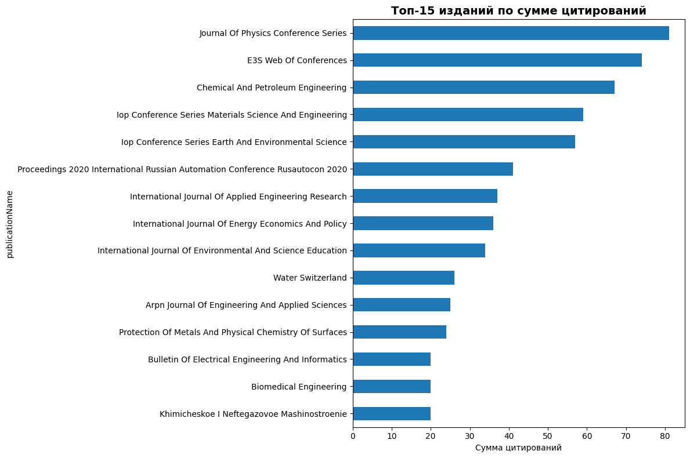

# Лабораторная работа: Наукометрический анализ публикаций ПензГТУ

В этой лабораторной мы анализируем выгрузку публикаций ПензГТУ (файл **PenzGTU_170925.xlsx**).

**Состав полей (основные):**
- `eid`, `doi`, `title` — идентификаторы и название публикации  
- `subtype`, `subtypeDescription` — тип публикации (журнал/конференция и т.п.)  
- `coverDate`, `ГОД` — дата и год публикации  
- `publicationName`, `issn`, `source_id` — издание  
- `citedby_count` — цитирования  
- `openaccess`, `freetoread`, `freetoreadLabel` — открытый доступ  
- `fund_acr`, `fund_no`, `fund_sponsor` — финансирование  
- `authkeywords` — ключевые слова (если заполнены)


## 1. Загрузка данных
Загрузите данные и выведите первые 10 строк. Опишите, какие признаки присутствуют в таблице.


```python
import pandas as pd
import numpy as np
import matplotlib.pyplot as plt
import seaborn as sns
from sklearn.linear_model import LinearRegression

# Загрузка данных
df = pd.read_excel('PenzGTU_170925.xlsx')

# Вывод первых 10 строк и информации о данных
print("Первые 10 строк данных:")
print(df.head(10))
print("\nИнформация о данных:")
print(df.info())
print("\nОсновные статистики:")
print(df.describe())
```

    Первые 10 строк данных:
                       eid                                          doi  pii  \
    0  2-s2.0-105012463836                      10.17223/19988605/71/12  NaN   
    1  2-s2.0-105007165732  10.1109/SmartIndustryCon65166.2025.10985979  NaN   
    2  2-s2.0-105014163184               10.1109/EDM65517.2025.11096805  NaN   
    3  2-s2.0-105009218530            10.1109/ICIEAM65163.2025.11028360  NaN   
    4  2-s2.0-105007153390  10.1109/SmartIndustryCon65166.2025.10986049  NaN   
    5  2-s2.0-105009226741            10.1109/ICIEAM65163.2025.11028560  NaN   
    6  2-s2.0-105007160549  10.1109/SmartIndustryCon65166.2025.10986231  NaN   
    7  2-s2.0-105007139482  10.1109/SmartIndustryCon65166.2025.10985973  NaN   
    8  2-s2.0-105007145609  10.1109/SmartIndustryCon65166.2025.10986164  NaN   
    9  2-s2.0-105009237341            10.1109/ICIEAM65163.2025.11028348  NaN   
    
       pubmed_id                                              title subtype  \
    0        NaN  FPGA implementation and comparative analysis o...      ar   
    1        NaN  Toward the Use of a Block of Two Planar Spiral...      cp   
    2        NaN  Simulation Models of Electrophysiological Sign...      cp   
    3        NaN  To the Question of Comparison in Magnetostrict...      cp   
    4        NaN  Combined Approach to Signature Verification Ba...      cp   
    5        NaN  Investigation of the Magnetic Field Strength D...      cp   
    6        NaN  Text Tone Analysis in Social Networks: Researc...      cp   
    7        NaN  Psychological Profiling of Users Based on Soci...      cp   
    8        NaN  Integration of Large Language Models and Compu...      cp   
    9        NaN  Modeling of Task Manager with Dynamic Distribu...      cp   
    
      subtypeDescription          creator  afid  \
    0            Article    Ushenina I.V.   NaN   
    1   Conference Paper    Knyazkov A.V.   NaN   
    2   Conference Paper      Sidorova M.   NaN   
    3   Conference Paper   Vorontsov A.A.   NaN   
    4   Conference Paper   Tantserov A.H.   NaN   
    5   Conference Paper    Knyazkov A.V.   NaN   
    6   Conference Paper  Martyshkin A.I.   NaN   
    7   Conference Paper     Zotkina A.A.   NaN   
    8   Conference Paper      Markin E.I.   NaN   
    9   Conference Paper  Martyshkin A.I.   NaN   
    
                                  affilname  ...  pageRange description  \
    0  Penza State Technological University  ...    120-129         NaN   
    1  Penza State Technological University  ...    725-729         NaN   
    2  Penza State Technological University  ...  1650-1654         NaN   
    3  Penza State Technological University  ...  1034-1039         NaN   
    4  Penza State Technological University  ...    759-764         NaN   
    5  Penza State Technological University  ...  1040-1045         NaN   
    6  Penza State Technological University  ...  1014-1020         NaN   
    7  Penza State Technological University  ...    782-787         NaN   
    8  Penza State Technological University  ...    777-781         NaN   
    9  Penza State Technological University  ...    889-895         NaN   
    
       authkeywords  citedby_count  openaccess  freetoread freetoreadLabel  \
    0           NaN              0           0         NaN             NaN   
    1           NaN              0           0         NaN             NaN   
    2           NaN              0           0         NaN             NaN   
    3           NaN              0           0         NaN             NaN   
    4           NaN              0           0         NaN             NaN   
    5           NaN              0           0         NaN             NaN   
    6           NaN              0           0         NaN             NaN   
    7           NaN              0           0         NaN             NaN   
    8           NaN              0           0         NaN             NaN   
    9           NaN              0           0         NaN             NaN   
    
       fund_acr fund_no fund_sponsor  
    0       NaN     NaN          NaN  
    1       NaN     NaN          NaN  
    2       NaN     NaN          NaN  
    3       NaN     NaN          NaN  
    4       NaN     NaN          NaN  
    5       NaN     NaN          NaN  
    6       NaN     NaN          NaN  
    7       NaN     NaN          NaN  
    8       NaN     NaN          NaN  
    9       NaN     NaN          NaN  
    
    [10 rows x 37 columns]
    
    Информация о данных:
    <class 'pandas.core.frame.DataFrame'>
    RangeIndex: 738 entries, 0 to 737
    Data columns (total 37 columns):
     #   Column               Non-Null Count  Dtype  
    ---  ------               --------------  -----  
     0   eid                  738 non-null    object 
     1   doi                  591 non-null    object 
     2   pii                  6 non-null      object 
     3   pubmed_id            2 non-null      float64
     4   title                738 non-null    object 
     5   subtype              738 non-null    object 
     6   subtypeDescription   738 non-null    object 
     7   creator              738 non-null    object 
     8   afid                 0 non-null      float64
     9   affilname            737 non-null    object 
     10  affiliation_city     736 non-null    object 
     11  affiliation_country  737 non-null    object 
     12  author_count         0 non-null      float64
     13  author_names         0 non-null      float64
     14  author_ids           0 non-null      float64
     15  author_afids         0 non-null      float64
     16  coverDate            738 non-null    object 
     17  ГОД                  738 non-null    int64  
     18  coverDisplayDate     738 non-null    object 
     19  publicationName      738 non-null    object 
     20  issn                 590 non-null    object 
     21  source_id            738 non-null    int64  
     22  eIssn                455 non-null    object 
     23  aggregationType      738 non-null    object 
     24  volume               591 non-null    object 
     25  issueIdentifier      493 non-null    object 
     26  article_number       234 non-null    object 
     27  pageRange            533 non-null    object 
     28  description          0 non-null      float64
     29  authkeywords         0 non-null      float64
     30  citedby_count        738 non-null    int64  
     31  openaccess           738 non-null    int64  
     32  freetoread           215 non-null    object 
     33  freetoreadLabel      215 non-null    object 
     34  fund_acr             0 non-null      float64
     35  fund_no              0 non-null      float64
     36  fund_sponsor         0 non-null      float64
    dtypes: float64(11), int64(4), object(22)
    memory usage: 213.5+ KB
    None
    
    Основные статистики:
              pubmed_id  afid  author_count  author_names  author_ids  \
    count  2.000000e+00   0.0           0.0           0.0         0.0   
    mean   2.576357e+07   NaN           NaN           NaN         NaN   
    std    2.991514e+05   NaN           NaN           NaN         NaN   
    min    2.555204e+07   NaN           NaN           NaN         NaN   
    25%    2.565781e+07   NaN           NaN           NaN         NaN   
    50%    2.576357e+07   NaN           NaN           NaN         NaN   
    75%    2.586934e+07   NaN           NaN           NaN         NaN   
    max    2.597511e+07   NaN           NaN           NaN         NaN   
    
           author_afids          ГОД     source_id  description  authkeywords  \
    count           0.0   738.000000  7.380000e+02          0.0           0.0   
    mean            NaN  2017.185637  1.262968e+10          NaN           NaN   
    std             NaN     7.051619  1.002943e+10          NaN           NaN   
    min             NaN  1995.000000  1.293300e+04          NaN           NaN   
    25%             NaN  2016.000000  2.893800e+04          NaN           NaN   
    50%             NaN  2020.000000  1.990020e+10          NaN           NaN   
    75%             NaN  2021.000000  2.110083e+10          NaN           NaN   
    max             NaN  2025.000000  2.110131e+10          NaN           NaN   
    
           citedby_count  openaccess  fund_acr  fund_no  fund_sponsor  
    count     738.000000  738.000000       0.0      0.0           0.0  
    mean        1.779133    0.291328       NaN      NaN           NaN  
    std         3.230410    0.454682       NaN      NaN           NaN  
    min         0.000000    0.000000       NaN      NaN           NaN  
    25%         0.000000    0.000000       NaN      NaN           NaN  
    50%         1.000000    0.000000       NaN      NaN           NaN  
    75%         2.000000    1.000000       NaN      NaN           NaN  
    max        36.000000    1.000000       NaN      NaN           NaN  


## Предобработка и приведение типов
Проведите предобработку данных (см. ниже комментарии в коде). Удалите пропуски, приведите данныек единым типам.


```python
# Приведение года к целому числу
df['ГОД'] = pd.to_numeric(df['ГОД'], errors='coerce').astype('Int64')

# Цитирования в число
df['citedby_count'] = pd.to_numeric(df['citedby_count'], errors='coerce').fillna(0).astype(int)

# Открытый доступ — к бинарному виду
if 'openaccess' in df.columns:
    df['openaccess'] = df['openaccess'].map({1: 1, 0: 0}).fillna(0).astype(int)
else:
    df['openaccess'] = 0

# Нормализация названий изданий
if 'publicationName' in df.columns:
    df['publicationName'] = df['publicationName'].str.strip().str.title()

# Создание удобного столбца 'year'
df['year'] = df['ГОД']

# Удаление строк с пропусками в ключевых полях
df = df.dropna(subset=['ГОД'])

print(f"После предобработки: {len(df)} записей")
```

    После предобработки: 738 записей


## 2. Публикации по годам
Постройте график распределения публикаций по годам. Как изменилась публикационная активность за последние 5 лет?


```python
plt.figure(figsize=(12, 6))
pub_by_year = df['year'].value_counts().sort_index()
plt.plot(pub_by_year.index, pub_by_year.values, marker='o', linewidth=2, markersize=6)
plt.title('Распределение публикаций по годам', fontsize=14, fontweight='bold')
plt.xlabel('Год')
plt.ylabel('Количество публикаций')
plt.grid(True, alpha=0.3)
plt.xticks(rotation=45)
plt.tight_layout()
plt.show()

# Анализ последних 5 лет
current_year = pd.Timestamp.now().year
last_5_years = range(current_year-5, current_year)
pub_last_5 = df[df['year'].isin(last_5_years)]['year'].value_counts().sort_index()

print("Публикации за последние 5 лет:")
for year, count in pub_last_5.items():
    print(f"{year}: {count} публикаций")
```


    

    


    Публикации за последние 5 лет:
    2020: 105 публикаций
    2021: 82 публикаций
    2022: 53 публикаций
    2023: 61 публикаций
    2024: 45 публикаций


## 3. Распределение по типам публикаций (`subtypeDescription`)
Визуализируйте распределение публикаций по типам (статья, доклад, обзор и прочее).


```python
plt.figure(figsize=(10, 6))
subtype_counts = df['subtypeDescription'].value_counts()
plt.pie(subtype_counts.values, labels=subtype_counts.index, autopct='%1.1f%%', startangle=90)
plt.title('Распределение публикаций по типам', fontsize=14, fontweight='bold')
plt.axis('equal')
plt.tight_layout()
plt.show()

print("Распределение по типам публикаций:")
print(subtype_counts)
```


    

    


    Распределение по типам публикаций:
    subtypeDescription
    Article             384
    Conference Paper    333
    Review               10
    Book Chapter          9
    Erratum               1
    Editorial             1
    Name: count, dtype: int64


## 4. Топ изданий по числу публикаций и по сумме цитирований
Выведите топ-15 изданий по числу публикаций и по сумме цитирований


```python
# Топ-15 по числу публикаций
top_pubs = df['publicationName'].value_counts().head(15)

plt.figure(figsize=(12, 8))
top_pubs.plot(kind='barh')
plt.title('Топ-15 изданий по числу публикаций', fontsize=14, fontweight='bold')
plt.xlabel('Количество публикаций')
plt.gca().invert_yaxis()
plt.tight_layout()
plt.show()

# Топ-15 по сумме цитирований
top_cited = df.groupby('publicationName')['citedby_count'].sum().sort_values(ascending=False).head(15)

plt.figure(figsize=(12, 8))
top_cited.plot(kind='barh')
plt.title('Топ-15 изданий по сумме цитирований', fontsize=14, fontweight='bold')
plt.xlabel('Сумма цитирований')
plt.gca().invert_yaxis()
plt.tight_layout()
plt.show()

print("Топ-15 изданий по числу публикаций:")
print(top_pubs)
print("\nТоп-15 изданий по сумме цитирований:")
print(top_cited)
```


    

    


    

    


    Топ-15 изданий по числу публикаций:
    publicationName
    Chemical And Petroleum Engineering                                                                  60
    Iop Conference Series Earth And Environmental Science                                               36
    Journal Of Physics Conference Series                                                                35
    E3S Web Of Conferences                                                                              33
    Aip Conference Proceedings                                                                          22
    Iop Conference Series Materials Science And Engineering                                             21
    Izvestiya Vysshikh Uchebnykh Zavedenii Seriya Teknologiya Tekstil Noi Promyshlennosti               20
    Lecture Notes In Networks And Systems                                                               17
    Biomedical Engineering                                                                              13
    Indian Journal Of Science And Technology                                                            11
    Avtomatika I Telemekhanika                                                                          10
    International Journal Of Applied Engineering Research                                                9
    Ecology And Industry Of Russia                                                                       9
    Instruments And Experimental Techniques                                                              9
    International Conference Of Young Specialists On Micro Nanotechnologies And Electron Devices Edm     9
    Name: count, dtype: int64
    
    Топ-15 изданий по сумме цитирований:
    publicationName
    Journal Of Physics Conference Series                                            81
    E3S Web Of Conferences                                                          74
    Chemical And Petroleum Engineering                                              67
    Iop Conference Series Materials Science And Engineering                         59
    Iop Conference Series Earth And Environmental Science                           57
    Proceedings 2020 International Russian Automation Conference Rusautocon 2020    41
    International Journal Of Applied Engineering Research                           37
    International Journal Of Energy Economics And Policy                            36
    International Journal Of Environmental And Science Education                    34
    Water Switzerland                                                               26
    Arpn Journal Of Engineering And Applied Sciences                                25
    Protection Of Metals And Physical Chemistry Of Surfaces                         24
    Bulletin Of Electrical Engineering And Informatics                              20
    Biomedical Engineering                                                          20
    Khimicheskoe I Neftegazovoe Mashinostroenie                                     20
    Name: citedby_count, dtype: int64


## 5. Цитируемость: распределение и динамика
Постройте гистограмму распределения цитирований и график цитирований по годам


```python
# Гистограмма распределения цитирований
plt.figure(figsize=(12, 6))
plt.subplot(1, 2, 1)
# Исключаем выбросы для лучшей визуализации
cited_filtered = df[df['citedby_count'] <= df['citedby_count'].quantile(0.95)]['citedby_count']
plt.hist(cited_filtered, bins=30, alpha=0.7, edgecolor='black')
plt.title('Распределение цитирований\n(исключены 5% выбросов)', fontweight='bold')
plt.xlabel('Количество цитирований')
plt.ylabel('Частота')

# Динамика цитирований по годам
plt.subplot(1, 2, 2)
cites_by_year = df.groupby('year')['citedby_count'].mean()
plt.plot(cites_by_year.index, cites_by_year.values, marker='o', color='red', linewidth=2)
plt.title('Средние цитирования по годам', fontweight='bold')
plt.xlabel('Год')
plt.ylabel('Среднее количество цитирований')
plt.grid(True, alpha=0.3)
plt.xticks(rotation=45)

plt.tight_layout()
plt.show()
```


    

    


## 6. Открытый доступ (OA) и его динамика
Рассчитайте долю публикаций с открытым доступом для каждого года.


```python
oa_by_year = df.groupby('year')['openaccess'].mean() * 100

plt.figure(figsize=(10, 6))
plt.plot(oa_by_year.index, oa_by_year.values, marker='s', color='green', linewidth=2)
plt.title('Динамика доли публикаций с открытым доступом', fontsize=14, fontweight='bold')
plt.xlabel('Год')
plt.ylabel('Доля OA публикаций (%)')
plt.grid(True, alpha=0.3)
plt.xticks(rotation=45)
plt.tight_layout()
plt.show()

print("Доля публикаций с открытым доступом по годам:")
for year, percent in oa_by_year.items():
    print(f"{year}: {percent:.1f}%")
```


    

    


    Доля публикаций с открытым доступом по годам:
    1995: 0.0%
    1996: 0.0%
    1997: 0.0%
    1998: 0.0%
    1999: 0.0%
    2000: 0.0%
    2001: 0.0%
    2002: 0.0%
    2003: 0.0%
    2004: 0.0%
    2005: 0.0%
    2006: 0.0%
    2007: 0.0%
    2008: 0.0%
    2009: 0.0%
    2010: 0.0%
    2011: 0.0%
    2012: 0.0%
    2013: 0.0%
    2014: 0.0%
    2015: 28.2%
    2016: 36.1%
    2017: 3.0%
    2018: 20.5%
    2019: 47.2%
    2020: 52.4%
    2021: 48.8%
    2022: 39.6%
    2023: 24.6%
    2024: 28.9%
    2025: 12.5%


## 7. Средние цитирования по изданиям
Определите Топ-20 изданий по цитированию (какие были процитирован чаще всего)


```python
top_20_mean_cited = df.groupby('publicationName')['citedby_count'].mean().sort_values(ascending=False).head(20)

plt.figure(figsize=(12, 8))
top_20_mean_cited.plot(kind='barh')
plt.title('Топ-20 изданий по среднему количеству цитирований', fontsize=14, fontweight='bold')
plt.xlabel('Среднее количество цитирований')
plt.gca().invert_yaxis()
plt.tight_layout()
plt.show()

print("Топ-20 изданий по среднему количеству цитирований:")
print(top_20_mean_cited)
```


    

    


    Топ-20 изданий по среднему количеству цитирований:
    publicationName
    International Journal Of Energy Economics And Policy                                                                                      36.000000
    International Journal Of Environmental And Science Education                                                                              34.000000
    Water Switzerland                                                                                                                         26.000000
    Eastern European Journal Of Enterprise Technologies                                                                                       14.000000
    International Journal Of Emerging Technologies In Learning                                                                                11.000000
    International Journal Of Advanced Computer Science And Applications                                                                       10.000000
    Bulletin Of Electrical Engineering And Informatics                                                                                        10.000000
    Ekonomicheskaya Politika                                                                                                                   9.000000
    2016 13Th International Scientific Technical Conference On Actual Problems Of Electronic Instrument Engineering Apeie 2016 Proceedings     8.000000
    Proceedings 2018 Global Smart Industry Conference Glosic 2018                                                                              8.000000
    Case Studies In Construction Materials                                                                                                     8.000000
    Rpc 2017 Proceedings Of The 2Nd Russian Pacific Conference On Computer Technology And Applications                                         8.000000
    Plant Soil And Environment                                                                                                                 7.000000
    Proceedings 2023 International Conference On Industrial Engineering Applications And Manufacturing Icieam 2023                             7.000000
    International Journal Of Technology                                                                                                        7.000000
    Khimicheskoe I Neftegazovoe Mashinostroenie                                                                                                6.666667
    Protection Of Metals And Physical Chemistry Of Surfaces                                                                                    6.000000
    Defence S And T Technical Bulletin                                                                                                         6.000000
    Sovremennye Problemy Distantsionnogo Zondirovaniya Zemli Iz Kosmosa                                                                        6.000000
    International Journal Of Advanced Trends In Computer Science And Engineering                                                               6.000000
    Name: citedby_count, dtype: float64


## 8. Очень высоко цитируемые публикации
Определите Топ-10 наиболее высоко цитируемых статей (какие были процитированы чаще всего)


```python
top_10_cited = df.nlargest(10, 'citedby_count')[['title', 'year', 'publicationName', 'citedby_count']]

print("Топ-10 наиболее цитируемых публикаций:")
for i, (idx, row) in enumerate(top_10_cited.iterrows(), 1):
    print(f"{i}. {row['title'][:80]}... | {row['year']} | {row['publicationName']} | Цитирований: {row['citedby_count']}")
```

    Топ-10 наиболее цитируемых публикаций:
    1. Population of the world and regions as the principal energy consumer... | 2018 | International Journal Of Energy Economics And Policy | Цитирований: 36
    2. Crop insurance as a means of increasing efficiency of agricultural production in... | 2016 | International Journal Of Environmental And Science Education | Цитирований: 34
    3. Graphene Oxide-Chitosan Composites for Water Treatment from Copper Cations... | 2022 | Water Switzerland | Цитирований: 26
    4. Models and methods of forecasting pitting corrosion... | 2010 | Protection Of Metals And Physical Chemistry Of Surfaces | Цитирований: 19
    5. Building Neural Network for Pattern Recognition... | 2020 | Proceedings 2020 International Russian Automation Conference Rusautocon 2020 | Цитирований: 18
    6. Multifunctional Fiberoptic Sensors For Space Infrastructure... | 2021 | Eastern European Journal Of Enterprise Technologies | Цитирований: 14
    7. Russian literary-critical reception of burns at turning of the XIX–XX centuries... | 2018 | Opcion | Цитирований: 14
    8. Using queuing theory to describe adaptive mathematical models of computing syste... | 2020 | Bulletin Of Electrical Engineering And Informatics | Цитирований: 12
    9. Optimization in work modeling of a mixer... | 2018 | Journal Of Physics Conference Series | Цитирований: 12
    10. Efficiency of the use of neutralized phosphogypsum, phosphorite processing waste... | 2020 | Environmental Quality Management | Цитирований: 11


## 9. Открытый доступ и цитируемость (сравнение средних)
Проанализируйте, как влияет открытый доступ на цитируемость публикаций


```python
oa_citation = df.groupby('openaccess')['citedby_count'].mean()

plt.figure(figsize=(8, 6))
oa_citation.plot(kind='bar', color=['skyblue', 'lightcoral'])
plt.title('Сравнение средних цитирований: OA vs не-OA', fontsize=14, fontweight='bold')
plt.xlabel('Открытый доступ (0 - нет, 1 - да)')
plt.ylabel('Среднее количество цитирований')
plt.xticks(rotation=0)
plt.tight_layout()
plt.show()

print("Сравнение цитирований:")
print(f"Публикации без OA: {oa_citation[0]:.2f} цитирований в среднем")
print(f"Публикации с OA: {oa_citation[1]:.2f} цитирований в среднем")

# T-тест для проверки значимости различий
from scipy import stats
oa_0 = df[df['openaccess'] == 0]['citedby_count']
oa_1 = df[df['openaccess'] == 1]['citedby_count']
t_stat, p_value = stats.ttest_ind(oa_0, oa_1, equal_var=False)

print(f"\nT-тест: t-статистика = {t_stat:.3f}, p-значение = {p_value:.3f}")
if p_value < 0.05:
    print("Различия статистически значимы (p < 0.05)")
else:
    print("Различия не являются статистически значимыми")

```


    

    


    Сравнение цитирований:
    Публикации без OA: 1.63 цитирований в среднем
    Публикации с OA: 2.15 цитирований в среднем
    
    T-тест: t-статистика = -2.045, p-значение = 0.041
    Различия статистически значимы (p < 0.05)


## 10. Прогноз числа публикаций на следующий год (линейная регрессия)
Постройте прогноз числа публикаций на следующий год. Самое простое - используйте линейную регрессию. Можно использовать и другие


```python
# Подготовка данных для прогноза
pub_count_by_year = df['year'].value_counts().sort_index()
years = pub_count_by_year.index.values.reshape(-1, 1)
counts = pub_count_by_year.values

# Линейная регрессия
model = LinearRegression()
model.fit(years, counts)

# Прогноз на следующий год
next_year = np.array([[years.max() + 1]])
prediction = model.predict(next_year)[0]

plt.figure(figsize=(10, 6))
plt.scatter(years, counts, color='blue', s=50, label='Фактические данные')
plt.plot(years, model.predict(years), color='red', linewidth=2, label='Линейный тренд')
plt.scatter(next_year, prediction, color='green', s=100, marker='*', label=f'Прогноз: {prediction:.0f} публ.')
plt.title('Прогноз числа публикаций на следующий год', fontsize=14, fontweight='bold')
plt.xlabel('Год')
plt.ylabel('Количество публикаций')
plt.legend()
plt.grid(True, alpha=0.3)
plt.tight_layout()
plt.show()

print(f"Прогноз числа публикаций на {next_year[0][0]} год: {prediction:.0f} публикаций")
print(f"Коэффициент детерминации (R²): {model.score(years, counts):.3f}")
```


    

    


    Прогноз числа публикаций на 2026 год: 58 публикаций
    Коэффициент детерминации (R²): 0.521

