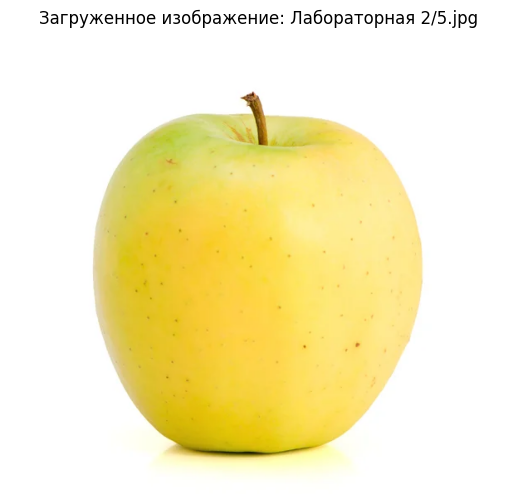

## Задание

Дана фотография одинокого яблока крупно на очень светлом или очень темном фоне в формате JPEG.

Имя файла с фотографией вводится с клавиатуры. Какое это яблоко - зеленое, желтое, белое (очень светложелтое или светло-зеленое) или красное?

Ответ вывести названием цвета (одно слово) на русском языке в нижнем регистре.


```python
from PIL import Image
import numpy as np
import math
from sklearn.cluster import KMeans
import matplotlib.pyplot as plt
```

Наборы цветов


```python
colorSet = {'зеленое': (95,134,55), 'желтое': (225,190,44),
            'красное': (176,68,73), 'белое': (205,205,185),
            'белый фон': (255,255,255), 'темный фон': (40,40,40)}
```

Загрузите изображение и выведите его на экран


```python
# !gdown --folder 1VCi8k2IClU__VSRG0N_Err4fYtZc6bQb
```


```python
filename = input('Введите имя файла (например: Лабораторная 2/1.jpg): ')
image = Image.open(filename)
```

    Введите имя файла (например: Лабораторная 2/1.jpg):  Лабораторная 2/5.jpg


```python
plt.figure(figsize=(8, 6))
plt.imshow(image)
plt.axis('off')
plt.title(f'Загруженное изображение: {filename}')
plt.show()
```


    

    


```python
scale_factor = 0.25
new_size = (int(image.width * scale_factor), int(image.height * scale_factor))
image_small = image.resize(new_size, Image.Resampling.LANCZOS)
```


```python
def distanse(a,b):
  r = (a[0]-b[0])**2 + (a[1]-b[1])**2 + (a[2]-b[2])**2
  return math.sqrt(r)
```


```python
if image.mode != 'RGB':
    image = image.convert('RGB')
```


```python
img_array = np.array(image_small)
```


```python
pixels = img_array.reshape(-1, 3)
```


```python
kmeans = KMeans(n_clusters=12, random_state=0, n_init=10)
kmeans.fit(pixels)
colors = kmeans.cluster_centers_.astype(int)
```


```python
def is_background(color):
    # Проверяем, является ли цвет фоном (очень светлым или очень темным)
    return (color[0] > 200 and color[1] > 200 and color[2] > 200) or \
           (color[0] < 60 and color[1] < 60 and color[2] < 60)
```


```python
cluster_counts = np.bincount(kmeans.labels_)
sorted_indices = np.argsort(-cluster_counts)
```


```python
dominant_color = None
for idx in sorted_indices:
    color = colors[idx]
    if not is_background(color):
        dominant_color = color
        break
```


```python
if dominant_color is None:
    dominant_color = colors[sorted_indices[0]]
```


```python
min_distance = float('inf')
best_match = None
```


```python
for color_name, color_value in colorSet.items():
    if color_name not in ['белый фон', 'темный фон']:  
        d = distanse(dominant_color, color_value)
        if d < min_distance:
            min_distance = d
            best_match = color_name
```


```python
print(best_match)
```

    белое

